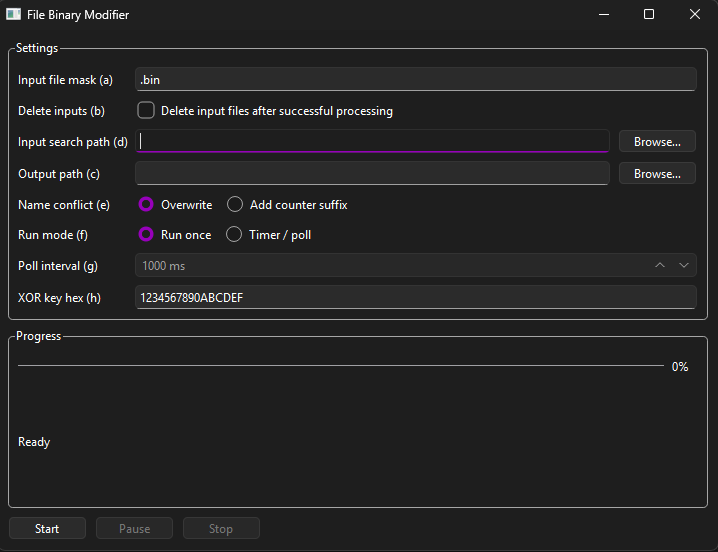

# FileBinModifier

Qt Widgets tool that finds files by mask and XOR-modifies them with an 8-byte hex key. Supports large files (chunked I/O), pause/resume, one-shot or timer polling, and optional input deletion.



## Build

```powershell
cmake -S . -B build -G Ninja -DCMAKE_PREFIX_PATH="C:\Qt\6.11.1\mingw_64"
cmake --build build
```

Requires Qt 6 Widgets.
